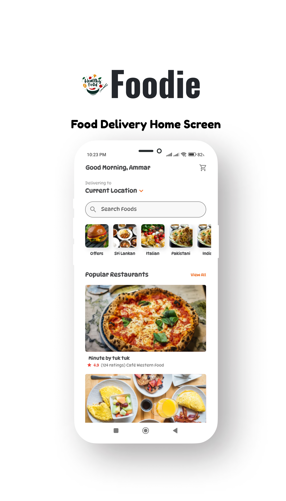

  <h1 align="center">🍽 Foodi</h1>
<h3 align="center"> Food ordering Home screen using Flutter </h3>

  <p align="center">
   
  
  </p>

Design is build with custom widgets to easily maintain multiple views and generic list (horizontal or vertical)




<h2>Usage: </h2>

```bash

git clone https://github.com/universal-developer/Flutter_Food_App_ui

cd Flutter_Food_App_ui

flutter pub get

flutter run

```
